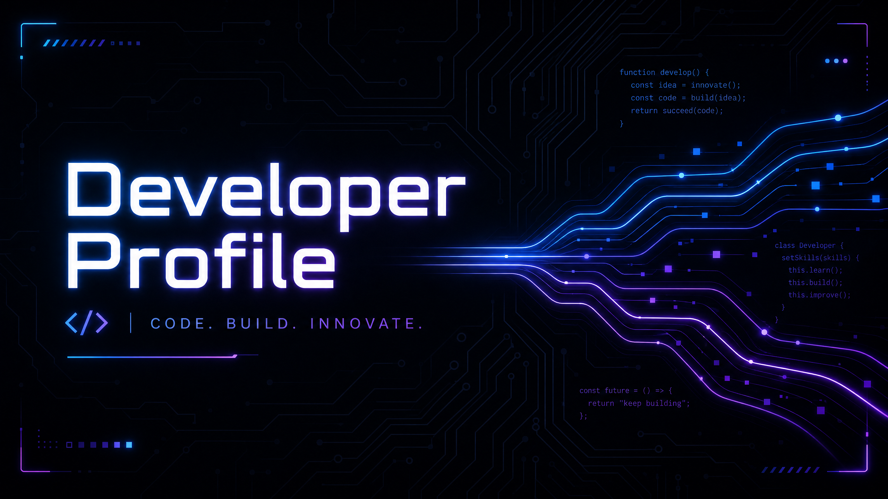

# Developer Profile

  

  

I'm a developer passionate about machine learning, AI systems, and data engineering — turning raw data into things that actually work.

## 🚀 What I Build

I specialize in **ML/AI and data engineering** with a keen interest in **building intelligent pipelines, training models, and deploying scalable data-driven systems**.

## ✨ Featured Projects

<!--START_SECTION:projects-->

- **Project Alpha**: A brief description of Project Alpha. [Link](https://github.com/TwilightOnSol/project-alpha)
- **Project Beta**: A brief description of Project Beta. [Link](https://github.com/TwilightOnSol/project-beta)

<!--END_SECTION:projects-->

## 🛠️ Skills & Technologies

| Category        | Technologies                                          |
|-----------------|-------------------------------------------------------|
| **Languages**   | Python, JavaScript, TypeScript, Java, Kotlin, Lua     |
| **ML / AI**     | PyTorch, TensorFlow, scikit-learn, HuggingFace        |
| **Data**        | Pandas, NumPy, SQL, Spark                             |
| **Infra**       | Docker, Kubernetes                                    |
| **Other**       | Git, GitHub Actions, REST APIs                        |

## 📊 GitHub Stats

<!--START_SECTION:stats-->

  
  
  

<!--END_SECTION:stats-->

## ✍️ Currently Working On

<!--START_SECTION:now-->

(This section will be dynamically updated with current activities)

<!--END_SECTION:now-->

## 📬 Get in Touch

- [GitHub](https://github.com/TwilightOnSol)
- [LinkedIn Profile](https://www.linkedin.com/in/yourprofile)
- [Personal Website](https://yourwebsite.com)

---
